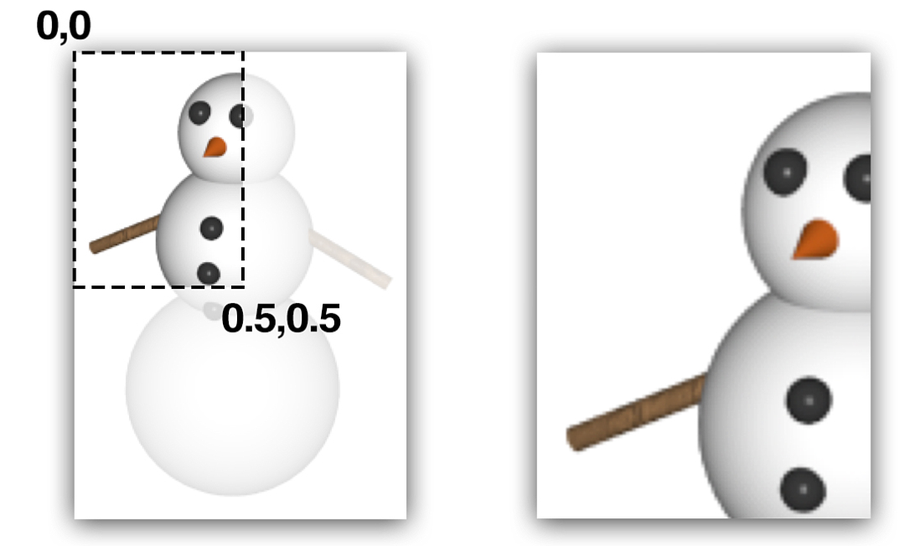
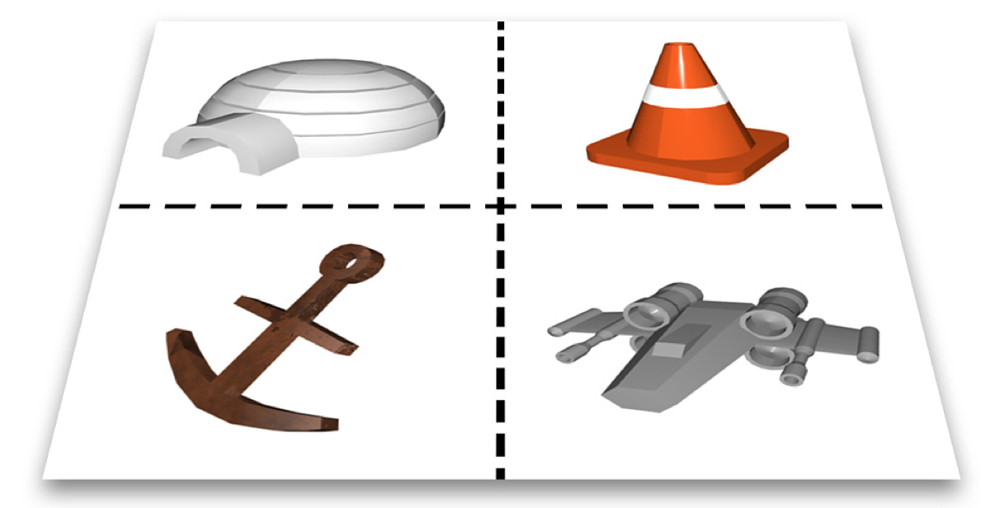

# contentsRect


&nbsp;&nbsp;&nbsp;&nbsp;CALayer的`contentsRect`属性允许我们在图层边框里显示寄宿图的一个子域。这涉及到图片是如何显示和拉伸的，所以要比`contentsGravity`灵活多了

&nbsp;&nbsp;&nbsp;&nbsp;和`bounds`，`frame`不同，`contentsRect`不是按点来计算的，它使用了*单位坐标*，单位坐标指定在0到1之间，是一个相对值（像素和点就是绝对值）。所以他们是相对与寄宿图的尺寸的。iOS使用了以下的坐标系统：

* 点 —— 在iOS和Mac OS中最常见的坐标体系。点就像是虚拟的像素，也被称作逻辑像素。在标准设备上，一个点就是一个像素，但是在Retina设备上，一个点等于2*2个像素。iOS用点作为屏幕的坐标测算体系就是为了在Retina设备和普通设备上能有一致的视觉效果。
* 像素 —— 物理像素坐标并不会用来屏幕布局，但是仍然与图片有相对关系。UIImage是一个屏幕分辨率解决方案，所以指定点来度量大小。但是一些底层的图片表示如CGImage就会使用像素，所以你要清楚在Retina设备和普通设备上，他们表现出来了不同的大小。
* 单位 —— 对于与图片大小或是图层边界相关的显示，单位坐标是一个方便的度量方式， 当大小改变的时候，也不需要再次调整。单位坐标在OpenGL这种纹理坐标系统中用得很多，Core Animation中也用到了单位坐标。

&nbsp;&nbsp;&nbsp;&nbsp;默认的`contentsRect`是{0, 0, 1, 1}，这意味着整个寄宿图默认都是可见的，如果我们指定一个小一点的矩形，图片就会被裁剪（如图2.6）



图2.6 一个自定义的`contentsRect`（左）和之前显示的内容（右）

&nbsp;&nbsp;&nbsp;&nbsp;事实上给`contentsRect`设置一个负数的原点或是大于{1, 1}的尺寸也是可以的。这种情况下，最外面的像素会被拉伸以填充剩下的区域。

&nbsp;&nbsp;&nbsp;&nbsp;`contentsRect`在app中最有趣的地方在于一个叫做*image sprites*（图片拼合）的用法。如果你有游戏编程的经验，那么你一定对图片拼合的概念很熟悉，图片能够在屏幕上独立地变更位置。抛开游戏编程不谈，这个技术常用来指代载入拼合的图片，跟移动图片一点关系也没有。

&nbsp;&nbsp;&nbsp;&nbsp;典型地，图片拼合后可以打包整合到一张大图上一次性载入。相比多次载入不同的图片，这样做能够带来很多方面的好处：内存使用，载入时间，渲染性能等等

&nbsp;&nbsp;&nbsp;&nbsp;2D游戏引擎入Cocos2D使用了拼合技术，它使用OpenGL来显示图片。不过我们可以使用拼合在一个普通的UIKit应用中，对！就是使用`contentsRect`

&nbsp;&nbsp;&nbsp;&nbsp;首先，我们需要一个拼合后的图表 —— 一个包含小一些的拼合图的大图片。如图2.7所示：



&nbsp;&nbsp;&nbsp;&nbsp;接下来，我们要在app中载入并显示这些拼合图。规则很简单：像平常一样载入我们的大图，然后把它赋值给四个独立的图层的`contents`，然后设置每个图层的`contentsRect`来去掉我们不想显示的部分。

&nbsp;&nbsp;&nbsp;&nbsp;我们的工程中需要一些额外的视图。（为了避免太多代码。我们将使用Interface Builder来拜访他们的位置，如果你愿意还是可以用代码的方式来实现的）。清单2.3有需要的代码，图2.8展示了结果

```objective-c

@interface ViewController ()
@property (nonatomic, weak) IBOutlet UIView *coneView;
@property (nonatomic, weak) IBOutlet UIView *shipView;
@property (nonatomic, weak) IBOutlet UIView *iglooView;
@property (nonatomic, weak) IBOutlet UIView *anchorView;
@end

@implementation ViewController

- (void)addSpriteImage:(UIImage *)image withContentRect:(CGRect)rect toLayer:(CALayer *)layer //set image
{
  layer.contents = (__bridge id)image.CGImage;

  //scale contents to fit
  layer.contentsGravity = kCAGravityResizeAspect;

  //set contentsRect
  layer.contentsRect = rect;
}

- (void)viewDidLoad
{
  [super viewDidLoad]; //load sprite sheet
  UIImage *image = [UIImage imageNamed:@"Sprites.png"];
  //set igloo sprite
  [self addSpriteImage:image withContentRect:CGRectMake(0, 0, 0.5, 0.5) toLayer:self.iglooView.layer];
  //set cone sprite
  [self addSpriteImage:image withContentRect:CGRectMake(0.5, 0, 0.5, 0.5) toLayer:self.coneView.layer];
  //set anchor sprite
  [self addSpriteImage:image withContentRect:CGRectMake(0, 0.5, 0.5, 0.5) toLayer:self.anchorView.layer];
  //set spaceship sprite
  [self addSpriteImage:image withContentRect:CGRectMake(0.5, 0.5, 0.5, 0.5) toLayer:self.shipView.layer];
}
@end
```


&nbsp;&nbsp;&nbsp;&nbsp;拼合不仅给app提供了一个整洁的载入方式，还有效地提高了载入性能（单张大图比多张小图载入地更快），但是如果有手动安排的话，他们还是有一些不方便的，如果你需要在一个已经创建好的品和图上做一些尺寸上的修改或者其他变动，无疑是比较麻烦的。

&nbsp;&nbsp;&nbsp;&nbsp;Mac上有一些商业软件可以为你自动拼合图片，这些工具自动生成一个包含拼合后的坐标的XML或者plist文件，拼合图片的使用大大简化。这个文件可以和图片一同载入，并给每个拼合的图层设置`contentsRect`，这样开发者就不用手动写代码来摆放位置了。

&nbsp;&nbsp;&nbsp;&nbsp;这些文件通常在OpenGL游戏中使用，不过呢，你要是有兴趣在一些常见的app中使用拼合技术，那么一个叫做LayerSprites的开源库（[https://github.com/nicklockwood/LayerSprites](https://github.com/nicklockwood/LayerSprites))，它能够读取Cocos2D格式中的拼合图并在普通的Core Animation层中显示出来。
